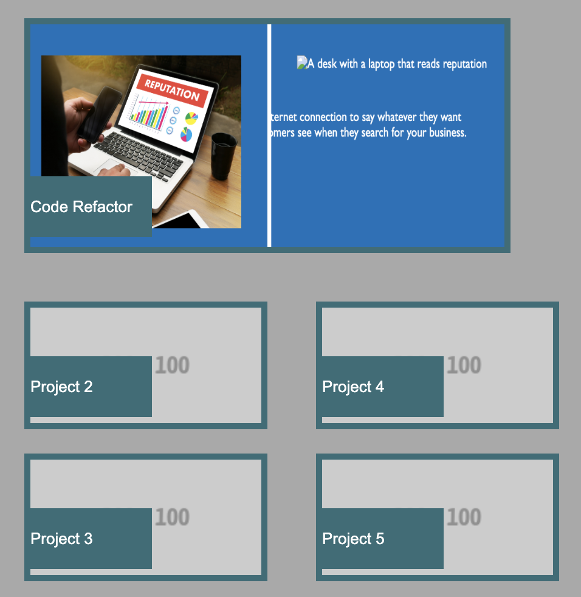
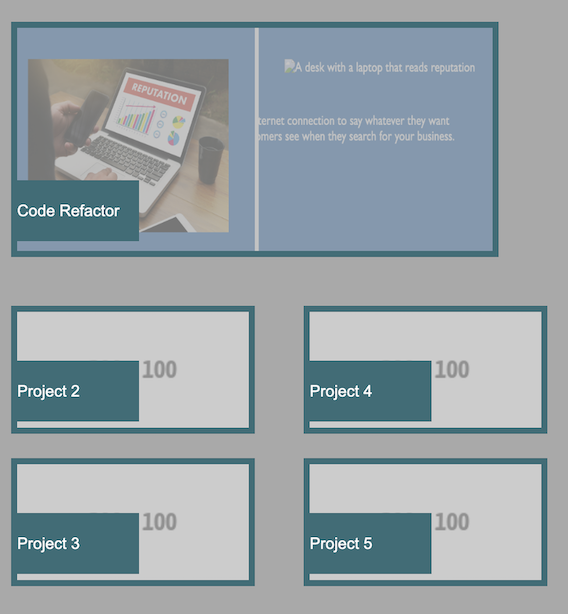

# Portfolio

## Description

- Portfolio is the second challenge.
- The purpose of this repository is to create a portfolio used to provide sample work and developer information to employers.

## Usage

[Click here](https://hbarry89.github.io/Portfolio/) to navigate to the live link of this repository.

Checkout hover effects!

## Credit
### Resources
- Bootcamp Materials
- W3 Schools
- AskBCS Learning Assistant

### Applications Used
- VS Code

### Assets
- Reset Code: Bootcamp Materials Unit 2 Activity 11. 
- Avatar Photo: By Sidney lima from [Pexels](https://www.pexels.com/photo/silhouette-photography-of-woman-2011639/).
- Placeholder Image: From [Fake images please?](https://fakeimg.pl/) ([here](https://fakeimg.pl/200x100/)).

## Thank you for visiting!